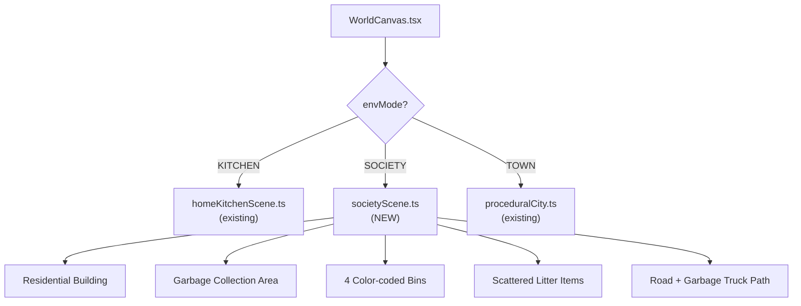
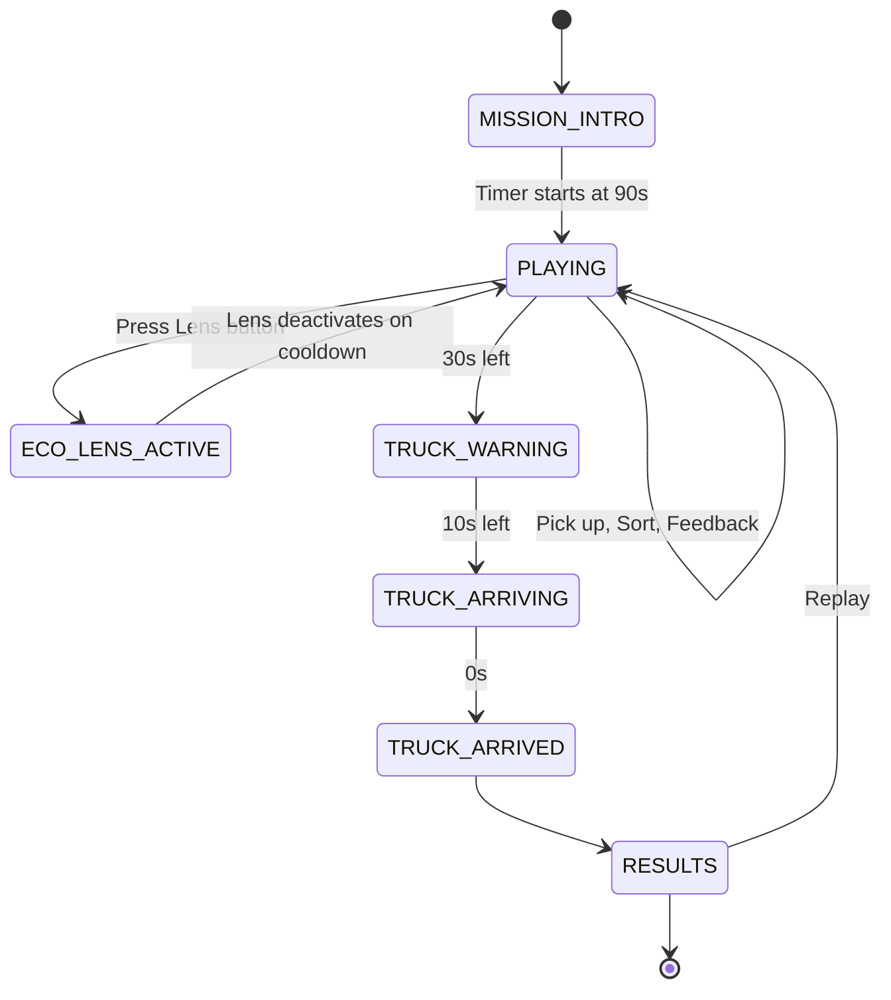
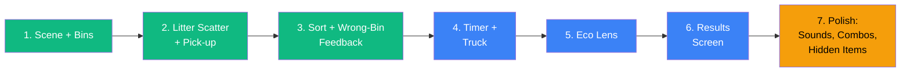

# Level 1: Waste Detective — Implementation Plan

> [!IMPORTANT]
> This plan transforms Level 1 from the existing "Home Kitchen" table-sorting mode into the full **"Waste Detective"** experience: an Indian residential society scene with scattered litter, a countdown timer, a garbage truck, and the Eco Lens mechanic.

---

## 1. Current State Analysis

### What already exists

| Asset / System | Location | Status |
|---|---|---|
| **4-bin system** (wet, dry, hazardous, e-waste + paper, plastic, reuse) | [`bins.ts`](file:///Users/bombermac/hackathon/EcoSort/src/data/bins.ts) | ✅ 7 bin types defined with hex colors, icons, labels |
| **10 Level-1 items** (banana peel, apple core, bread, veggie scraps, egg shell, cereal box, milk carton, soda can, plastic bottle, newspaper) | [`items.ts`](file:///Users/bombermac/hackathon/EcoSort/src/data/items.ts) | ✅ All have `unlockLevel: 1`, facts, icons, modelType |
| **Level config** (Level 1 = Home Kitchen, bins: wet + dry) | [`levels.ts`](file:///Users/bombermac/hackathon/EcoSort/src/data/levels.ts) | ⚠️ Needs redesign for Society scene and 4 bins |
| **Adaptive Spawner** (weighted probability, error-biased) | [`spawner.ts`](file:///Users/bombermac/hackathon/EcoSort/src/services/spawner.ts) | ✅ Reusable |
| **3D Home Kitchen scene** (Ghibli-style, bins, table, animations) | [`homeKitchenScene.ts`](file:///Users/bombermac/hackathon/EcoSort/src/components/world/homeKitchenScene.ts) | 🔄 Keep as reference, build new Society scene |
| **Procedural City / Town** | [`proceduralCity.ts`](file:///Users/bombermac/hackathon/EcoSort/src/components/world/proceduralCity.ts) | ✅ Existing town assets reusable |
| **Player Character (Kai)** | [`playerCharacter.ts`](file:///Users/bombermac/hackathon/EcoSort/src/components/world/playerCharacter.ts) | ✅ Walk, celebrate animations |
| **Locomotion** (click-to-move, WASD, obstacles) | [`locomotion.ts`](file:///Users/bombermac/hackathon/EcoSort/src/components/world/locomotion.ts) | ✅ |
| **3rd-person Camera** | [`thirdPersonCamera.ts`](file:///Users/bombermac/hackathon/EcoSort/src/components/world/thirdPersonCamera.ts) | ✅ |
| **3D item meshes** (15+ procedural models) | [`items/models/`](file:///Users/bombermac/hackathon/EcoSort/src/components/world/items/models/) | ✅ BananaPeel3D, Battery3D, etc. |
| **Throw animation** (arc flight to bin) | [`WorldCanvas.tsx`](file:///Users/bombermac/hackathon/EcoSort/src/components/world/WorldCanvas.tsx#L558-L636) | ✅ `executeThrow()` |
| **Scoring, streaks, energy meter** | [`WorldPage.tsx`](file:///Users/bombermac/hackathon/EcoSort/src/components/world/WorldPage.tsx#L56-L65) | ✅ |
| **Mascot dialogue** | [`MascotDialogue.tsx`](file:///Users/bombermac/hackathon/EcoSort/src/components/game/MascotDialogue.tsx) | ✅ |
| **Audio service** (throw, correct, incorrect, speech) | [`audio.ts`](file:///Users/bombermac/hackathon/EcoSort/src/services/audio.ts) | ✅ |
| **AWS backend** (Lambda, DynamoDB, Polly) | [`backend/`](file:///Users/bombermac/hackathon/EcoSort/backend/) | ✅ Progress saving works |

### What needs to be built

| Feature | Complexity | Priority |
|---|---|---|
| **Society Scene** (residential building, garbage area, scattered litter) | 🔴 High | P0 — Core |
| **Litter Scatter System** (items placed around scene, some hidden) | 🟡 Medium | P0 — Core |
| **Pick-up Mechanic** (walk to item, click/approach to grab) | 🟡 Medium | P0 — Core |
| **Countdown Timer** (90 sec, warnings at 30s and 10s) | 🟢 Low | P0 — Core |
| **Garbage Truck** (arrives at timer end, collects sorted waste) | 🟡 Medium | P1 — Important |
| **Eco Lens** (scan item → highlight correct bin, limited energy) | 🟡 Medium | P1 — Important |
| **4-Bin Layout** (Green, Blue, Red, Black with labels + icons) | 🟢 Low | P0 — Core |
| **Wrong-bin Feedback** (item returns to hand, explanation) | 🟢 Low | P0 — Core |
| **Cleanliness Meter** | 🟢 Low | P2 — Nice-to-have |
| **Combo Streak** (visual + bonus) | 🟢 Low | P2 — Already exists partially |
| **Waste Knowledge Cards** | 🟢 Low | P2 — Ecopedia exists |
| **Results Screen** (detailed breakdown) | 🟡 Medium | P1 — Important |
| **Ambiguous Items** (soiled cardboard, etc.) | 🟢 Low | P2 — Nice-to-have |
| **Replay with different layout** | 🟢 Low | P3 — Stretch |

---

## 2. Architecture Decisions

### 2.1 Scene Strategy



> [!NOTE]
> We add a **third environment mode** `'SOCIETY'` alongside the existing `'KITCHEN'` and `'TOWN'`. Level 1 defaults to `'SOCIETY'`. The existing Kitchen scene remains available as a toggle for development reference.

### 2.2 Bin Mapping for Level 1: Waste Detective

The game spec calls for 4 bins. Map to existing `BinType`:

| Game Bin | Color | `BinType` | Icon | Items |
|---|---|---|---|---|
| Wet / Biodegradable | 🟢 Green | `wet` | 🍎 Apple | Banana peel, veggie scraps, food plate, bread, egg shell |
| Dry Recyclable | 🔵 Blue | `dry` | 📦 Package | Cereal box, milk carton, soda can, plastic bottle, newspaper |
| Special / Hazardous | 🔴 Red | `hazardous` | ⚠️ AlertTriangle | Battery, light bulb, expired medicine |
| Residual | ⬛ Black | *NEW: `residual`* | 🗑️ Trash | Soiled cardboard, broken pen, used tissue |

> [!IMPORTANT]
> Add a new `BinType = 'residual'` to [`game.ts`](file:///Users/bombermac/hackathon/EcoSort/src/types/game.ts) and [`bins.ts`](file:///Users/bombermac/hackathon/EcoSort/src/data/bins.ts). Add 2–3 residual items to [`items.ts`](file:///Users/bombermac/hackathon/EcoSort/src/data/items.ts).

### 2.3 Game Flow State Machine



---

## 3. Implementation Phases

### Phase 1 — Scene and Core Sort (Days 1–2) `P0`

#### 1.1 Add `residual` bin type

**Files to change:**
- [`src/types/game.ts`](file:///Users/bombermac/hackathon/EcoSort/src/types/game.ts) — Add `'residual'` to `BinType` union
- [`src/data/bins.ts`](file:///Users/bombermac/hackathon/EcoSort/src/data/bins.ts) — Add `residual` entry (black, Trash2 icon)
- [`src/data/items.ts`](file:///Users/bombermac/hackathon/EcoSort/src/data/items.ts) — Add 3 residual items: `soiled_wrapper`, `broken_pen`, `used_tissue`

#### 1.2 Create Society Scene

**New file:** `src/components/world/societyScene.ts`

Build a procedural Three.js scene:

```
┌─────────────────────────────────────────────┐
│                 ROAD (top)                  │
│  ═══════════════════════════════════════    │
│              🚛 Truck path →                │
├─────────────────────────────────────────────┤
│                                             │
│   🏢 Residential        🗑️🗑️🗑️🗑️          │
│   Building               4 Bins             │
│   (entrance)            (collection area)   │
│                                             │
│        🍌  📦    🌿 bench                   │
│    scattered      (hidden item behind)      │
│    litter                                   │
│              🔋                              │
│                    📄                        │
│        🧃                                   │
│                                             │
│   Gate / Entrance                           │
└─────────────────────────────────────────────┘
```

**Scene elements (all procedural Three.js geometry):**

| Element | Geometry | Details |
|---|---|---|
| Ground plane | PlaneGeometry | Concrete texture, warm gray |
| Residential building | BoxGeometry stack | 3-story, balconies, painted walls (Indian apartment style) |
| Entrance gate | BoxGeometry + arch | Metal gate with "Eco Society" text |
| Garbage collection area | Ground marking | Slightly raised platform with bin slots |
| 4 Bins | CylinderGeometry | Green, Blue, Red, Black with labels + icons as sprites |
| Road | PlaneGeometry | Asphalt strip at top of scene |
| Bench | BoxGeometry | Wooden bench, hides 1–2 items behind it |
| Plants / Trees | ConeGeometry + CylinderGeometry | Low-poly, 2–3 decorative |
| Street lamp | CylinderGeometry + SphereGeometry | Warm point light |
| Garbage truck | BoxGeometry compound | Simple truck mesh, animated entry |

**Export interface:**
```typescript
export interface SocietySceneResult {
  societyGroup: THREE.Group;
  obstacles: THREE.Box3[];
  binMeshes: Map<BinType, THREE.Mesh>;
  binTriggers: Map<BinType, THREE.Mesh>;
  binGlowRings: Map<BinType, THREE.Mesh>;
  litterSpawnPoints: THREE.Vector3[];  // 12–15 positions
  hiddenSpawnPoints: THREE.Vector3[];  // 2–3 behind objects
  truckMesh: THREE.Group;
  truckStartPos: THREE.Vector3;
  truckEndPos: THREE.Vector3;
  animate: (elapsed: number, delta: number) => void;
  triggerBinAnimation: (bin: BinType) => void;
  animateTruckArrival: (progress: number) => void;
}
```

#### 1.3 Litter Scatter System

**New file:** `src/components/world/litterScatter.ts`

```typescript
export interface ScatteredItem {
  itemData: ItemData;
  mesh: THREE.Group;
  position: THREE.Vector3;
  isHidden: boolean;     // behind bench or plant
  isPickedUp: boolean;
  isInBin: boolean;
  assignedBin: BinType | null;
}

export interface LitterScatterSystem {
  items: ScatteredItem[];
  update: (playerPos: THREE.Vector3, delta: number) => void;
  getNearestPickupItem: (pos: THREE.Vector3, radius: number) => ScatteredItem | null;
  pickUp: (item: ScatteredItem) => void;
  getPickedUpItem: () => ScatteredItem | null;
  getRemainingCount: () => number;
  getCollectedCount: () => number;
  dispose: () => void;
}
```

- Randomly select 10–12 items from Level 1 pool
- Place 8–10 in visible positions, 2–3 behind bench or plants
- Item meshes use existing `createItemMesh()` from [`createItemMesh.ts`](file:///Users/bombermac/hackathon/EcoSort/src/components/world/items/createItemMesh.ts)
- Gentle hover + rotation animation for visibility
- Glow outline when player is within pickup radius (1.5 units)

#### 1.4 Pick-up Mechanic

**Modify:** [`WorldCanvas.tsx`](file:///Users/bombermac/hackathon/EcoSort/src/components/world/WorldCanvas.tsx)

When in `SOCIETY` mode:
1. Player walks near a scattered item (radius < 1.5)
2. HUD shows "Press E or Click to pick up [Item Name]"
3. Item attaches to player hand position (offset from player group)
4. Player walks to a bin, throw interaction triggers (existing drag-to-throw or click-bin)
5. Wrong bin → item returns to hand (not ground), alarm + explanation
6. Correct bin → item disappears into bin, +10 points, fact shown

#### 1.5 Update Level 1 Config

**Modify:** [`levels.ts`](file:///Users/bombermac/hackathon/EcoSort/src/data/levels.ts)

```typescript
{
  id: 1,
  name: 'Waste Detective',
  place: 'Eco Society',
  bins: ['wet', 'dry', 'hazardous', 'residual'],
  learningGoal: 'Sort waste into the right bin before the truck arrives.',
  energyLink: 'Correct sorting keeps the society clean and green.',
  targetCount: 12,
  sceneType: 'SOCIETY',   // NEW field
  timeLimit: 90,           // NEW field in seconds
}
```

---

### Phase 2 — Timer, Truck and Feedback (Day 3) `P0/P1`

#### 2.1 Countdown Timer

**New file:** `src/components/game/CountdownTimer.tsx`

- 90-second countdown displayed prominently in top-center HUD
- Visual states:
  - **Green** (90–31s): Normal play
  - **Amber** (30–11s): Warning pulse + mascot says "The truck is on its way!"
  - **Red** (10–1s): Urgent flash + truck horn sound
  - **Zero**: Gameplay stops

**New file:** `src/hooks/useCountdownTimer.ts`

```typescript
export function useCountdownTimer(seconds: number) {
  // Returns: timeLeft, isWarning, isUrgent, isExpired, start(), pause(), reset()
}
```

#### 2.2 Garbage Truck Animation

**Additions to `societyScene.ts`:**

- Truck mesh: compound BoxGeometry (cab + body + wheels)
- Color: white and green municipal truck style
- Parked off-screen right initially
- At 10s remaining: truck becomes visible, drives slowly toward collection area
- At 0s: truck stops at bins, plays "collection" animation (bins flash)
- Items in bins are collected (success). Items on ground remain visible as evidence of an incomplete cleanup.

```typescript
// In render loop when SOCIETY mode:
if (timeLeft <= 10 && timeLeft > 0) {
  const progress = 1 - (timeLeft / 10);
  societyScene.animateTruckArrival(progress);
}
```

#### 2.3 Wrong-Bin Feedback Enhancement

**Modify:** [`WorldPage.tsx`](file:///Users/bombermac/hackathon/EcoSort/src/components/world/WorldPage.tsx) `handleThrowItem`

Current behavior: wrong throw → mascot message, 0 points, next item spawns.

New behavior for Society mode:
1. Wrong throw → red alarm flash on bin
2. Item **returns to player hand** (not consumed)
3. Mascot explains: "Banana peels are biodegradable. Put this in the green bin."
4. Player must try again with the same item
5. Second wrong attempt on same item → auto-activate Eco Lens hint

---

### Phase 3 — Eco Lens (Day 4) `P1`

#### 3.1 Eco Lens System

**New file:** `src/systems/ecoLens.ts`

```typescript
export interface EcoLensState {
  energy: number;          // 0–100, starts at 100
  maxEnergy: number;       // 100
  cooldown: number;        // seconds remaining before next use
  cooldownDuration: number; // 8 seconds
  energyCostPerUse: number; // 20 (so 5 uses max)
  isActive: boolean;
  activeItemId: string | null;
  activeBinType: BinType | null;
}
```

#### 3.2 Eco Lens Visual Effect

**New file:** `src/components/game/EcoLensOverlay.tsx`

When activated:
1. Screen gets a subtle **teal/cyan tint overlay** (like looking through a special lens)
2. Held item shows a **colored glow ring** matching the correct bin
3. Correct bin **pulses with matching color** glow
4. Other bins **dim to grayscale**
5. Label appears: `"BANANA PEEL → GREEN BIN"`
6. Auto-deactivates after 3 seconds
7. Cooldown bar shown in HUD (8 seconds before next use)

**3D implementation:**
- Apply post-processing color tint via renderer
- Add emissive material boost on correct bin mesh
- Reduce emissive on other bin meshes
- After 3 seconds, revert all materials

#### 3.3 Eco Lens HUD Button

**Modify:** HUD in [`WorldCanvas.tsx`](file:///Users/bombermac/hackathon/EcoSort/src/components/world/WorldCanvas.tsx)

```
┌───────────────────────────────────────────────────────┐
│ [Exit] [Kai 🌱]  │  ⏱️ 0:45  Score: 80  │ [🔍 Eco Lens (3/5)] │
└───────────────────────────────────────────────────────┘
```

- Button shows remaining uses (energy divided by cost)
- Grayed out during cooldown with countdown overlay
- Keyboard shortcut: `L` key

---

### Phase 4 — Results and Polish (Day 5) `P1`

#### 4.1 Mission Results Screen

**New file:** `src/components/game/MissionResultsModal.tsx`

```
┌─────────────────────────────────────────┐
│         🏆 MISSION COMPLETE!            │
│                                          │
│  Items Sorted:       10 / 12             │
│  Correct on 1st try: 8                   │
│  Incorrect attempts:  3                  │
│  Litter left behind:  2 ⚠️              │
│  Eco Lens uses:      2 / 5              │
│  Time remaining:     12 seconds          │
│                                          │
│  ─── What You Learned ───               │
│  ✅ Banana peel → Green (compost)        │
│  ❌ Battery → tried Blue, correct: Red   │
│  💡 "Batteries contain acid."            │
│                                          │
│  Rating: ⭐⭐ Waste Warrior              │
│                                          │
│  [🔄 Play Again]  [➡️ Next Level]       │
└─────────────────────────────────────────┘
```

**Rating tiers:**

| Rating | Condition |
|---|---|
| 🌱 Eco Beginner | Less than 60% accuracy OR more than 4 items left |
| ⚔️ Waste Warrior | 60–89% accuracy AND 2 or fewer items left |
| 🏆 Eco Champion | 90% accuracy or higher AND 0 items left |

#### 4.2 Cleanliness Meter

**New component:** `src/components/game/CleanlinessMeter.tsx`

- Visual meter (0–100%) in HUD
- Rises as player picks up and correctly sorts litter
- Falls if timer expires with waste remaining
- Formula: `(correctlySortedCount / totalLitterCount) × 100`

#### 4.3 Audio and Sound Effects

**Modify:** [`audio.ts`](file:///Users/bombermac/hackathon/EcoSort/src/services/audio.ts)

Add new sounds (Web Audio API oscillator-based):

| Method | Sound | When |
|---|---|---|
| `playTruckHorn()` | Low frequency horn | 10s warning |
| `playPickup()` | Soft pop | Pick up item |
| `playLensActivate()` | Sci-fi scan | Eco Lens on |
| `playLensCooldown()` | Subtle tick | Lens recharging |
| `playTruckJingle()` | Cheerful original melody | Truck arrives |
| `playTimerWarning()` | Gentle tick-tock | 30s remaining |
| `playTimerUrgent()` | Faster tick | 10s remaining |

---

### Phase 5 — Engagement Features (Day 6) `P2`

#### 5.1 Combo Streak Visual

Already exists in WorldPage (streak counter + bonus points). Enhance:
- 3-correct streak → confetti burst (`canvas-confetti` already in deps)
- 5-correct streak → "SORTING MASTER!" flash text
- Streak counter appears above Kai head in 3D

#### 5.2 Hidden Litter Discovery

- Items behind bench or plant have reduced opacity until player is within 2 units
- Discovery triggers: "You found hidden litter! +5 bonus"
- Subtle sparkle particle effect on discovery

#### 5.3 Ambiguous Items

Add to [`items.ts`](file:///Users/bombermac/hackathon/EcoSort/src/data/items.ts):

```typescript
{
  id: 'soiled_cardboard',
  name: 'Food-stained pizza box',
  bin: 'wet',  // NOT dry/recyclable because soiled
  unlockLevel: 1,
  fact: 'Food-stained cardboard cannot be recycled. It goes in the wet bin.',
  icon: '📦',
  modelType: 'cardboard',
  color: '#92400e',
  isAmbiguous: true,  // NEW flag
}
```

When player sorts ambiguous items correctly, the mascot gives special praise with extra explanation.

#### 5.4 Waste Knowledge Cards

Reuse existing **Ecopedia** system. On wrong answer:
- Show a mini knowledge card inline (not modal)
- Optional "Learn More" button opens full Ecopedia card

#### 5.5 Replay Challenge

- On replay, randomize:
  - Which 12 items spawn (from pool of 15+)
  - Spawn positions shuffled
  - Hidden items change location
  - Timer stays at 90s

---

## 4. File Change Summary

### New Files (11)

| File | Purpose |
|---|---|
| `src/components/world/societyScene.ts` | 3D residential society scene |
| `src/components/world/litterScatter.ts` | Scattered item placement and pick-up system |
| `src/components/game/CountdownTimer.tsx` | Timer HUD component |
| `src/components/game/CleanlinessMeter.tsx` | Cleanliness progress bar |
| `src/components/game/EcoLensOverlay.tsx` | Lens visual effect overlay |
| `src/components/game/MissionResultsModal.tsx` | Detailed results screen |
| `src/systems/ecoLens.ts` | Eco Lens state management |
| `src/hooks/useCountdownTimer.ts` | Timer hook |
| `src/components/world/items/models/Wrapper3D.ts` | Residual item mesh |
| `src/components/world/items/models/Tissue3D.ts` | Residual item mesh |
| `src/components/world/items/models/BrokenPen3D.ts` | Residual item mesh |

### Modified Files (8)

| File | Changes |
|---|---|
| [`src/types/game.ts`](file:///Users/bombermac/hackathon/EcoSort/src/types/game.ts) | Add `'residual'` to BinType, add `sceneType` and `timeLimit` to LevelConfig |
| [`src/data/bins.ts`](file:///Users/bombermac/hackathon/EcoSort/src/data/bins.ts) | Add `residual` bin definition |
| [`src/data/items.ts`](file:///Users/bombermac/hackathon/EcoSort/src/data/items.ts) | Add 3 residual items and 1 ambiguous item |
| [`src/data/levels.ts`](file:///Users/bombermac/hackathon/EcoSort/src/data/levels.ts) | Update Level 1 config |
| [`src/components/world/WorldCanvas.tsx`](file:///Users/bombermac/hackathon/EcoSort/src/components/world/WorldCanvas.tsx) | Add `SOCIETY` env mode, pick-up logic, Eco Lens 3D effects |
| [`src/components/world/WorldPage.tsx`](file:///Users/bombermac/hackathon/EcoSort/src/components/world/WorldPage.tsx) | Timer state, Eco Lens state, wrong-bin-returns-to-hand, results |
| [`src/services/audio.ts`](file:///Users/bombermac/hackathon/EcoSort/src/services/audio.ts) | New sound effects |
| [`src/components/world/items/createItemMesh.ts`](file:///Users/bombermac/hackathon/EcoSort/src/components/world/items/createItemMesh.ts) | Support new residual item modelTypes |

---

## 5. Implementation Order

> [!TIP]
> **Build the scene, sorting, and wrong-bin feedback first.** Then add the lens, countdown, truck animation, and sound. If you try to implement everything at once, you risk having a beautiful scene without a playable game.



### Milestone Checkpoints

| Milestone | What to demo | Validates |
|---|---|---|
| **M1** | Player walks around society, sees bins and scattered items | Scene works |
| **M2** | Player picks up banana peel, throws in wrong bin, gets explanation, tries again correctly | Core educational loop |
| **M3** | 90-second timer counts down, truck arrives, results show | Full game loop |
| **M4** | Eco Lens scan → correct bin highlighted → player sorts | Lens mechanic |
| **M5** | Hidden items found, combo streaks, cleanliness meter, knowledge cards | Engagement features |

> [!IMPORTANT]
> **M2 is the demo moment.** A player making a wrong choice, receiving a helpful explanation, using the Eco Lens to learn, and successfully sorting the next item — that single interaction communicates the educational value of the project.

---

## 6. Technical Notes

### Three.js Performance
- Society scene targets approximately 200 draw calls maximum (procedural geometry, no external model loading)
- Use `InstancedMesh` for repeated elements (windows, balcony railings)
- Bin labels use `CanvasTexture` sprites for crisp text at any angle

### Accessibility
- All bins have: **color + icon + text label + distinct shape**
- Eco Lens label shows text like "BANANA PEEL → GREEN BIN" (not color-only)
- Timer has audio cues at 30s and 10s, not just visual
- All mascot text follows ASD-STE100: 8 words or fewer per sentence

### Mobile and Touch
- Pick up: tap item when nearby
- Sort: tap target bin while holding item
- Eco Lens: tap lens button in HUD
- Drag-to-throw preserved as alternative
